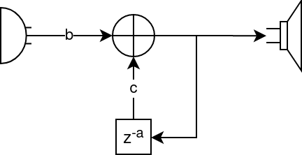

# Ejercicio 1: Supresor del habla

a. Sistema LTI

Este sistema es un sistema con realimentación unitaria. En este caso, el tema de amplificación no se tomará en cuenta y es asumido que la señal del micrófono y el parlante son compatibles.

1. Diagrama de bloques



En este caso, se ha puesto como parámetros de diseño:

* `a`: retardo en número de muestras
* `b` y `c`: pesos asignados a la señal directa y la retrasada (respectivamente).

2. Función de transferencia

La ecuación del sistema está dada por:

$$
y[n] = bx[n] + cy[n-a]
$$

donde $y[n]$ es la salida por el altavoz y $x[n]$ es la entrada del micrófono.

La función de transferencia está dada por:

$$
H(z) = \frac{Y(z)}{X(z)}
$$

Se requiere primero transformar la ecuación del sistema al dominio de Z:

$$
Y(z) = bX(z) + cY(z)z^{-a}
$$

Luego, resolviendo para $H(z)$:

$$
H(z) = \frac{b}{1 - cz^{-a}}
$$

3. Ecuación de diferencias:

Es la misma que la ecuación del sistema:

$$
y[n] = cy[n-a] +  bx[n]
$$

4. La respuesta al impulso está dada por:


b. Provea una expresión que convierta el retraso D de milisegundos a numero de muestra:

$$
a = \frac{Df_s}{1000}
$$

En este caso, $f_s$ es la frecuencia de muestreo en muestras/segundo.

c. Implementación

Dependencias:

* portaudio19-dev

Instalar:

```bash
sudo apt install portaudio19-dev
```

* pyaudio

Instalar :

```bash
pip3 install pyaudio
```

Archivo fuente: [aquí](./src/ex1.py)

Uso:

```bash
DELAY=300
python3 src/ex1.py $DELAY
```

d. ¿Cual es el valor de D en millisegundos que fue ḿas efectivo para suprimir el habla?

Fueron 300ms. 100ms no afecta tanto. Más de 300ms es manejable.

e. ¿Por qué dicho sistema sólo puede ser operado utilizando audífonos?

Los audífonos tienen mejor respuesta en frecuencia y aislamiento contra el ruido de ambiente.
