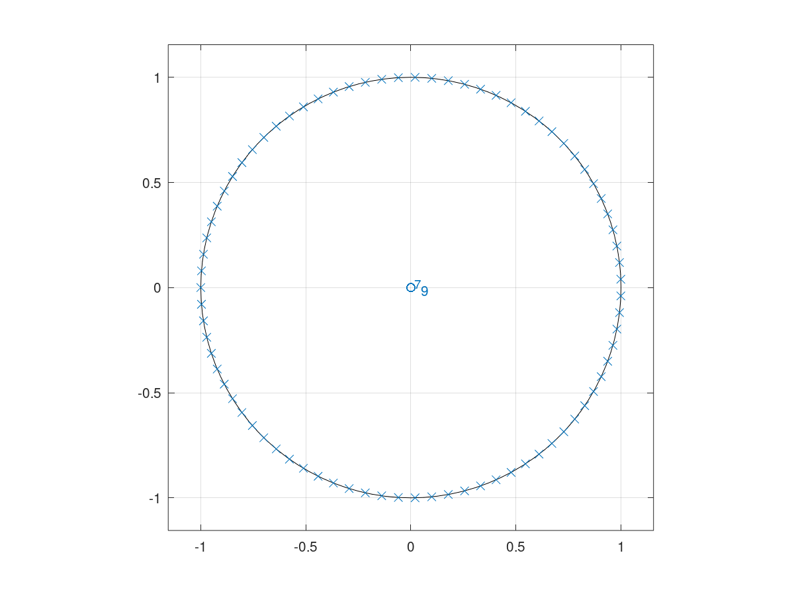

# Ejercicio 2

Dependencias:

* Octave
* Signal (package Octave)

Please, consider the following scripts for the following exercises

```octave
pkg load signal
nroots = 80
num = [1];
den = zeros(1, nroots);
den(1) = 1;
den(nroots) = 1;
zplane(num, den);
```

a. Presente el diagrama de polos y ceros del sistema



b. Presente la función de transferencia del sistema.

$$
H(z) = \frac{a}{1-z^{-80}}
$$

donde $a$ es una ganancia constante.

c. Presente la ecuación de diferencias del sistema.

$$
H(z) = Y(z) / X(z) \rightarrow Y(z) = H(z)X(z) 
$$

Detransformando:

$$
Y(z)(1 - z^{-80}) = aX(z)
$$

$$
y[n] = y[n-80] + ax[n]
$$

d. ¿Cómo se puede generalizar este sistema a N polos?

Se puede modificar el sistema a través de su ecuación de diferencias como:

$$
y[n] = y[n-N] + ax[n]
$$

o como su función de transferencia:

$$
H(z) = \frac{a}{1-z^{-N}}
$$

e. ¿Cómo se puede variar la distancia d de los polos al círculo unitario?

Agregando una constante $d$ de la siguiente manera:

$$
H(z) = \frac{a}{1-d^{N}z^{-N}}
$$

f. Clasifique el mismo en términos de causalidad y si es FIR o IIR.

Es un sistema recursivo IIR, ya que depende de una salida pasada y la entrada presente.

g. Clasifique el mismo en términos de estabilidad, para diferentes valores de $d$.

Para que el sistema sea estable, los polos tienen que estar en el círculo unitario. Para ello, $d$ tiene que ser menor o igual a 1.

$$
|d| \le 1
$$

