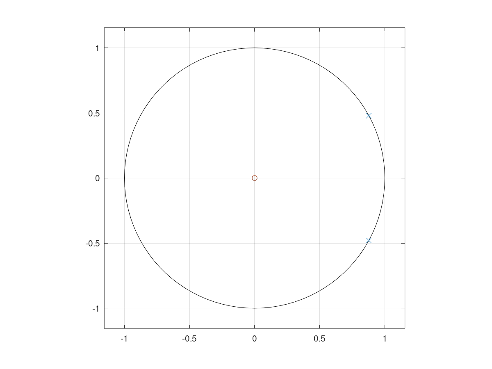

# Ejercicio 3: Resonador Bicuadrático

Diseñar un sistema de resonador bicuadrático que genere una señal:

$$
y[n] = r^n\sin[\omega_0 n]u[n]
$$

utilizando un sistema LTI de segundo orden.

a. Presente la función de transferencia.

Suponiendo que $x[n] = u[n]$, se tiene que:

$$
y[n] = h[n] \ast x[n]= h[n] \ast u[n]
$$

entonces, utilizando la transformación:

$$
\mathcal{Z} \{h[n] \ast u[n]\} = H(z) \frac{z^{-1}}{1 + z^{-1}} = \frac{rz^{-1}\sin \omega_0}{1 - 2rz^{-1}\cos \omega_0 +r^2z^{-2}}, |z| > |a|
$$

Tomando en cuenta la forma de la ecuación:

$$
H(z) = \frac{(rz^{-1}\sin \omega_0) (1 + z^{-1})}{z^{-1}(1 - 2rz^{-1}\cos \omega_0 +r^2z^{-2})}, |z| > |r|
$$

b. Los polos y zeros se determinan despejando la función de transferencia:

$$
\frac{rz \sin}{z^2 - 2rz \cos\omega_0 + r^2}
$$

* Ceros: {0} (multiplicidad 2)
* Polos: {$p_0 = r e^{-j\omega_0}$, $p_1 = r e^{j\omega_0}$}

c. Presente la ecuación de diferencias del sistema.

$$
Y(z) = H(z) X(z) = \frac{(rz^{-1}\sin \omega_0) (1 + z^{-1})}{z^{-1}(1 - 2rz^{-1}\cos \omega_0 +r^2z^{-2})} X(z)
$$

Usando fracciones parciales y un cambio de variable $x = z^{-1}$ y cancelando el polo en el origen con el zero en el origen:

$$
H(z) = \frac{A}{x - re^{-j\omega_0}} + \frac{B}{x - re^{j\omega_0}}
$$

Solucionando para A, B:

$$
A = \frac{\tan\omega_0 (1 + re^{-j\omega_0})}{2} = \frac{\tan\omega_0 (1 + p_0)}{2}
$$

$$
B = \frac{\tan\omega_0 (1 + re^{j\omega_0})}{2} = \frac{\tan\omega_0 (1 + p_1)}{2}
$$

Continua... 

d. Clasifique el mismo en términos de causalidad y si es FIR o IIR.

El sistema es IIR dado que:

* Depende de entradas anteriores
* Depende de salidas anteriores

e. Clasifique el mismo en términos de estabilidad para diferentes valores de r

Para que sea estable, $|r| < 1$. Suponiendo un $w_0$ y un $r = 1$

f. ¿Qué señal de entrada permite la oscilación?

Un escalón unitario, ya que el sistema oscila per se

g. ¿Qué valor de $r$ permite una oscilación (teórica) estable (constante)?

$r = 1$

h. ¿Se recomienda esta técnica para implementar osciladores digitales?

El problema de esta técnica es el factor numérico. Si $r$ es ligeramente distinto, el sistema comienza a tener divergencia o ser inestable.

i. Implemente en GNU/Octave o Python dicho sistema para F0 = 440Hz.

